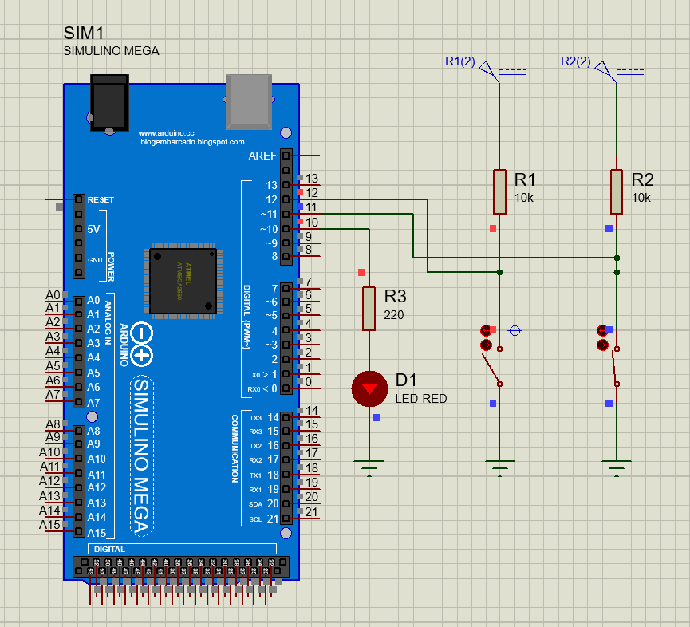

# ArduinoMegaIO

<<<<<<< HEAD
En el proyecto se uso el Arduino Mega 2560 para esta aplicacion es importante revisar los pines que concuerden con la placa Arduino en la que se este trabajando.
=======

>>>>>>> 4e21fbb66023fa7dc3d9df1fa80b3bb4cc94bb9c

Se uso el software AVRDUDESS para descargar el programa a la placa.